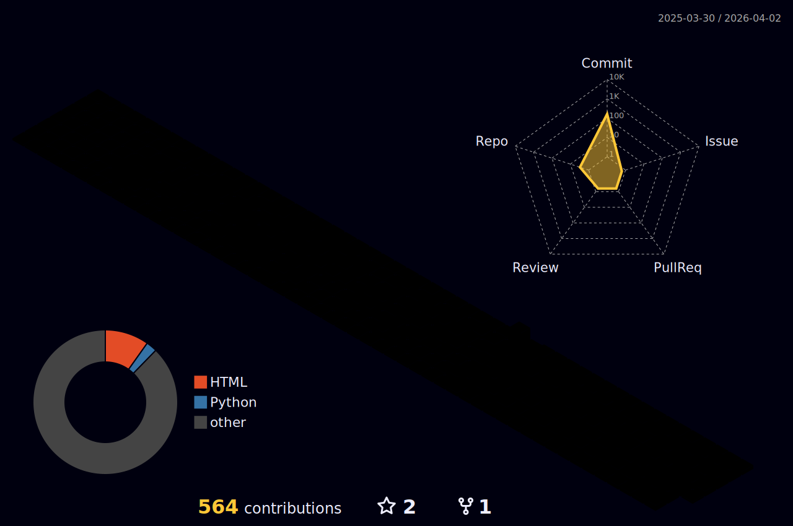

수정 중

              
    

    

    <h2 style="border-bottom: 1px solid #21262d; color: #c9d1d9;"> 🛠️ Tech Stacks </h2>   
    
 
          
          
          
          
           
          
          
          
          
           
          
          
          
          
           
                
          

    

    <h2 style="border-bottom: 1px solid #21262d; color: #c9d1d9;"> 🚀 Contributions </h2>   
    
 
          

    

      

    <h2 style="border-bottom: 1px solid #21262d; color: #c9d1d9;"> 🧑‍💻 User INFO </h2>   
    
 
        
    

