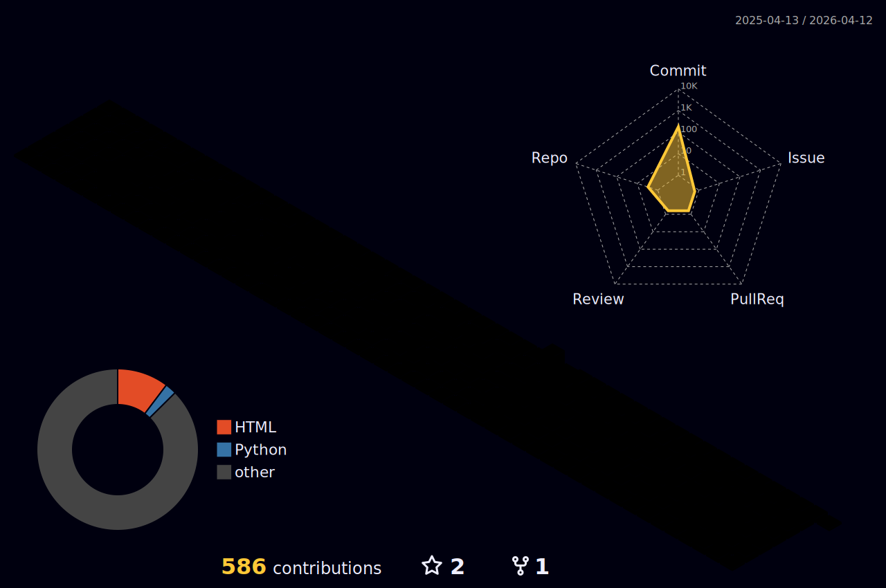

<!-- <div align= "center">
    <h2 style="border-bottom: 1px solid #21262d; color: #c9d1d9;"> 🛠️ Tech Stacks </h2> <br> 
    <div style="margin: 0 auto; text-align: center;" align= "center">
          
                  
          
          
          
          <br/>
          
          
          
          <br/>
          
          
          
          
          <br/>        
          
          <br> <br> <br> <br/>
          </div>
    </div>

<div align= "center">
    <h2 style="border-bottom: 1px solid #21262d; color: #c9d1d9;"> 🚀 Contributions </h2> <br> 
    <div style="margin: 0 auto; text-align: center;" align= "center"> 
          </div>
    </div>

<br> <br> <br> 


<div align="center">
    <h2 style="border-bottom: 1px solid #21262d; color: #c9d1d9;"> 🧑‍💻 User INFO </h2> <br> 
    <div style="margin: 0 auto; text-align: center;" align="center"> 
        &nbsp;&nbsp;&nbsp;&nbsp;&nbsp;&nbsp;&nbsp;&nbsp;&nbsp;<a href="https://github.com/jongeuni/markdown-box-generator">
            
        </a>
    </div>
</div> -->


# 역량·성과·포트폴리오 상세 기술서
**NHN AI 전환 백엔드 개발 직무 지원**

---

## 목차
1. [지원자 개요](#1-지원자-개요)
2. [경력 타임라인](#2-경력-타임라인)
3. [기술 스택](#3-기술-스택)
4. [프로젝트 상세: Check-Lab 시스템 (체크가드)](#4-프로젝트-상세-check-lab-시스템-체크가드)
5. [프로젝트 상세: Distribution Edge Cloud (체크가드)](#5-프로젝트-상세-distribution-edge-cloud-체크가드)
6. [프로젝트 상세: AI 이미지 검증 시스템 (타이아)](#6-프로젝트-상세-ai-이미지-검증-시스템-타이아)
7. [JD 요건 대비 역량 분석](#7-jd-요건-대비-역량-분석)
8. [AX 전환 실천 사례](#8-ax-전환-실천-사례)

---

## 1. 지원자 개요

2023년 4월부터 현재(2026년 5월)까지 약 3년간 두 개의 중소기업과 스타트업(타이아, 체크가드)에서 **Linux 서버 기반 Python/FastAPI 백엔드 개발, MySQL DB 설계·운영, Docker 컨테이너 배포, AI·이미지 처리 파이프라인 구축**을 전담했습니다.

3년간 단 하루도 빠짐없이 개발일지를 작성하며 기술 성장 과정을 기록했고, Claude Code 등 Agentic AI를 실무에 적극 활용하여 AX 전환을 직접 실천해 왔습니다.

JD의 자격 요건(Linux, Agentic AI 활용, Python BE 개발, AX 전환 관심)을 **전부 충족**하며, 다수의 우대 사항(FastAPI, DB·컨테이너, 클라우드, FE, 문서 작성)도 실무에서 검증된 역량을 보유하고 있습니다.

---

## 2. 경력 타임라인

| 기간 | 소속 | 역할 | 핵심 기술 |
|------|------|------|-----------|
| 2025.05 ~ 현재 | 체크가드 | 백엔드 전담 개발자 (1인) | Python, FastAPI, MySQL, Docker, Linux, WPF/C# |
| 2023.04 ~ 2025.04 | 타이아 | 연구원 → 백엔드 개발자 | Python, FastAPI, MySQL, Qt5, TCP/IP, Django ASGI |

---

## 3. 기술 스택

### Backend


### Frontend


### Infrastructure & DevOps
-Advanced-FCC624?style=flat-square&logo=linux&logoColor=black)


### AI / LLM

-Active_Use-EA4335?style=flat-square)


---

## 4. 프로젝트 상세: Check-Lab 시스템 (체크가드)

**기간:** 2025년 5월 ~ 현재  
**역할:** 백엔드와 DB 서버 배포 및 설계, 네트워크, 장비-웹 화면 시스템 전반 설계 전담 (3인 개발)  
**스택:** Python 3.11, FastAPI, Pydantic v2, MySQL, Docker Compose, Nginx, Linux Ubuntu, PyInstaller, WPF/C#, Inno Setup

### 4.1 멀티 센서 이미지·영상 분석 파이프라인

산업용 장비에서 수집된 **열화상(Thermal)·가시광(Vision)·UV** 3종 센서 데이터를 서버에서 처리하는 파이프라인을 설계·구현했습니다.

#### 개발 과정 타임라인

| 시기 | 내용 |
|------|------|
| 2025.06 초 | FastAPI 서버 임시 배포 완료. 열화상 정규화 `((temp - min) / (max - min)) * 255` 공식 확정 |
| 2025.06 중순 | Nginx 설치 권한 없어 수동 설치 후 설정 완료, SSL 인증서 발급·적용, curl 테스트 통과 |
| 2025.06 말 | CSV 파일 파싱 + 멀티 클라이언트 UUID 구분 기능 개발. int → float 연산 전환으로 열화상 노이즈 해소 |
| 2025.07~08 | FFT 파이프라인 1차 구현. 열화상 이미지 프로세싱 전반 고도화 |
| 2025.11 | WebRTC 기술 조사 → WebSocket 대비 채택 결정. `/3d-model/fft-stream/offer` 엔드포인트 설계 시작 |
| 2025.11~12 | WebRTC SDP Offer/Answer 교환 설계, `fft_stream_load_fft.py` 구현(get_fetch_results·read_fft_lines 완료) |
| 2026.05.19 | FFT v2.0.0 바이패스 처리 전면 고도화: 버전 분기, 타임스탬프 포맷 전환, MP4 지원 |
| 2026.05.20 | UV Fusion on/off 파싱, 팔레트 enum 파싱 -1 오프셋 버그 수정, 영상 렌더링 파이프라인 안정화 |
| 2026.05.21 | T-line 후행 세그먼트 파싱, 비동기 파이프라인 상태 관리 리팩토링, Swagger 통합, 폐쇄망 배포 스크립트 |
| 2026.05.22 | 레거시 팔레트 오프셋 보정, Viewer UI 전면 개편, PyInstaller 안정화 |
| 2026.05.26 | 422 유효성 검사 오류 해결, UV 스팟 탐지 알고리즘 통합 |
| 2026.05.27 | 레거시 가시광-UV 합성 복구, WAV 파형 시각화 통합, 런타임 인프라 보안 강화 |
| 2026.05.28 | 동영상 파일 매칭 패턴 완화, Launcher WPF 네이티브 쉘 도입, Inno Setup 패키징, DB OPTIMIZE |

---

**FFT v2.0.0+ 파이프라인 고도화 (2026.05.20)**
- v2.0.0+ 신규 규격 대응: 640x480 중심 435픽셀 크롭, 오프셋 보정 생략
- 신규 타임스탬프 포맷(`YYYY-MM-DD_HH:MM:SS`) 지원, 레거시 AVI 외 `*_V.mp4` 파일 대응
- 비동기 파이프라인 상태 관리: 초기 상태 `is_corrupted=2 / IN_PROGRESS` 설정 → 완료 시점 일괄 업데이트 (`_finalize_upload_history_status`)

**UV 스팟 탐지 알고리즘 통합 (2026.05.26)**
- `UVSpotDetector` 클래스: 800x600 가상 스케일링, ROI 추출, 다단계 윤곽선 검증
- 역어핀 변환(Inverse Affine Transformation) 행렬을 이용한 좌표 투영 재매핑
- v2.0.0 기준 버전 분기: 레거시는 `min_contrast=30` 강제 클램핑, 신규는 가변 파싱

**열화상 팔레트 오프셋 보정 (2026.05.22)**
- v2.0.0 미만 레거시: 팔레트 값 -1 오프셋 보정
- `parser.py` / `video_fft_parser.py` 전반 파싱 오프셋 균일화 동기화

**FFT T-line 후행 세그먼트 파싱 (2026.05.21)**
- `/P`, `/A` 키 세그먼트로부터 피크/평균 dB 값 직접 파싱
- `/D` 키 거리 데이터 소수점 첫째 자리 반올림 후 `ParsedDataDTO` 바인딩

#### 트러블슈팅

**열화상 노이즈 문제 (2025.06.18)**

> 증상: 열화상 이미지 처리 결과에 노이즈가 발생  
> 원인 분석: int형으로 픽셀값을 계산하면서 소수점이 잘려 오차 누적  
> 해결: float형으로 전환하여 `((temp - min) / (max - min)) * 255.0` 연산 수행

**Nginx 설치 권한 문제 (2025.06.13~17)**

> 증상: Linux 서버에 Nginx 설치 권한 없어 `nginx` 명령어 사용 불가  
> 원인 분석: PATH 환경변수에 Nginx 실행 파일 경로 미등록, sudo 권한 제한  
> 해결: root 권한 문의 후 획득 → EPEL 저장소 설치 → Nginx 수동 설치 → SSL 인증서 발급(`/opt/apache/conf/` 경로 활용) → curl 테스트 통과

**팔레트 Enum 파싱 오류로 인한 DB DataError (2026.05.20)**

> 증상: 팔레트 열거형 파싱 시 `-1` 오프셋이 DB 삽입 단계에서 DataError 발생  
> 원인 분석: 레거시 버전 대응 코드에서 팔레트 인덱스에 -1을 빼는 보정 로직이 v2.0.0 이상에도 적용되고 있었음  
> 해결: 버전 분기 처리로 v2.0.0 미만에만 -1 오프셋 보정 적용, 이상 버전은 기준선 인덱스 유지

**비동기 파이프라인 조기 상태 업데이트 문제 (2026.05.21)**

> 증상: 업로드 파이프라인 처리 중간에 DB 상태가 완료로 업데이트되어 실제 완료 여부와 불일치 발생  
> 원인 분석: 검증기(`validator.py`)가 파이프라인 중간에 DB 상태를 갱신하는 구조  
> 해결: 초기 상태를 `is_corrupted=2 / IN_PROGRESS`로 고정하고, 파이프라인 완료 시점에만 일괄 업데이트하는 `_finalize_upload_history_status` 함수 도입. 예외 발생 시 Failed 상태로 전환 보장

**422 유효성 검사 오류 (2026.05.26)**

> 증상: 비디오 프레임 FFT 요청/응답 시 422 Unprocessable Entity 반복 발생  
> 원인 분석:  
> - `FrameFftRequest.time` 필드가 `str | int | float` 혼용 케이스를 처리하지 못함  
> - `fft_array` 필드가 `List[float]` 단순 타입이어서 백엔드 직렬화 시 `ResponseValidationError` 발생  
> 해결:  
> - `time` 필드에 `str | int | float` 유니온 타입 허용 + 공백·빈값 정규화 Pydantic 검증기 추가  
> - `fft_array`를 `List[FrameFftPoint]` (`x`, `y` 좌표) 구조체로 대체

**동영상 파일 매칭 실패 (2026.05.28)**

> 증상: `.mp4` 확장자 파일 중 `_V` 접미사 없는 케이스에서 "missing file" 오판단 발생  
> 원인 분석: 파일 매칭 로직이 `*_V.mp4` 패턴만 인식하도록 구현되어 있었음  
> 해결: 모든 `.mp4`·`.avi` 파일을 대소문자 구분 없이 수용하도록 매칭 패턴 완화. FFmpeg 동일 소스 덮어쓰기 방지 예외 방어 로직 추가

---

### 4.2 FastAPI 기반 API 서버 설계·운영

**Swagger Docs 통합 및 API 스키마 구조 개편 (2026.05.21)**
- FastAPI 커스텀 `/swagger` 엔드포인트 구성, 태그별 라우터 구조화
- 암묵적 페이로드 → 강타입 Pydantic 스키마 대체 (`api_models.py` 통합)
- uvicorn 동적 핫 리로드(Hot-reloading) 컨텍스트 활성화

**스토리지 쿼터 관리 API (2026.04.28)**
- `/cleanup-deleted-upload`: `is_deleted` 데이터 일괄 삭제, user_id 유무에 따른 분기 처리
- `/cleanup_user_upload`: 특정 사용자 전체 데이터 삭제

---

### 4.3 Check-Lab Viewer (Windows 데스크탑 앱)

산업 현장에서 사용할 **독립형 Windows 데스크탑 뷰어**를 설계·구현·패키징했습니다.

**UI/UX 설계 (2026.05.22~27)**
- 에페메럴 Edge `--app` 모드: 세션 자동 삭제, 캐시 오염 방지
- 글래스모피즘 UI: 가시·열화상·UV·스펙트로그램·FFT 그래프 통합 단일 레이아웃
- 열화상 캔버스 위 CSV 값 직접 투영하는 인터랙티브 3분할 매핑
- WAV 파형 시각화: 독립형 캔버스 파이프라인 통합, 라이트박스 연동
- 라이트박스 4-in-1 에셋 내보내기: 오버레이 2개 + FFT 그래프 2개 동시 저장

**PIL 기반 고해상도 오버샘플링(4x) 네온 로딩 오버레이 (2026.05.22)**
- 파일 처리 파이프라인을 전용 백그라운드 스레드로 이관, UI 스레드 반응성 유지

**PyInstaller 패키징·안정화 (2026.05.22~27)**
- TrueType 폰트(`arial.ttf`, `arialbd.ttf`) 번들링
- 크롬 `SingletonLock` 감시 로직: 웹 서버 조기 해제 레이스 컨디션 방지
- 브라우저 종료 시 `.viewer-cache`, `logs`, 임시 환경 완전 클린업
- 로컬 캐시 경로: `%LOCALAPPDATA%\ESTsoft\UDViewer` (OneDrive 락 우회)

#### Viewer 트러블슈팅

**레이스 컨디션: 브라우저 종료 후 서버 조기 해제 (2026.05.22)**

> 증상: 브라우저 종료 이벤트 시 자산 HTTP 요청이 처리되기 전에 웹 서버가 해제되어 `ERR_CONNECTION_REFUSED` 발생  
> 원인 분석: 브라우저 수명 주기 추적과 동적 프로필 처리가 같은 흐름에서 경쟁 상태 발생  
> 해결: 크롬 `SingletonLock` 감시 로직 도입. 브라우저 수명 주기 추적과 동적 프로필 분리

**PyInstaller EXE 실행 시 0바이트 이미지 출력 (2026.05.22)**

> 증상: 패키징된 EXE 실행 시 열화상·UV·스펙트로그램·FFT 그래프가 0바이트로 생성  
> 원인 분석: PyInstaller SPEC에서 의존 폰트 파일 및 정적 경로 매핑 누락  
> 해결: `arial.ttf`·`arialbd.ttf` 번들링, 임시 경로 만료 방지를 위한 정적 로컬 디렉터리 매핑, 폴백 구조 재구축

**OneDrive 클라우드 동기화 락 문제 (2026.05.27)**

> 증상: 런타임 캐시 및 로그 파일 삭제 실패로 클린업 불완전  
> 원인 분석: 기본 임시 경로가 OneDrive 동기화 범위 내에 있어 파일 락 발생  
> 해결: 캐시·로그 경로를 `%LOCALAPPDATA%\ESTsoft\UDViewer`로 이관. 읽기 전용 속성 해제 + 점진적 재시도 루프를 포함한 방어적 셸 삭제 핸들러 구현

---

### 4.4 Check-Lab Launcher (WPF/C# 설치 프로그램)

**WPF + WebView2 하이브리드 아키텍처 (2026.05.28)**
- 네이티브 랜딩 쉘 + WebView2 컨테이너 하이브리드 구조
- 프로세스 완료 시 WebView2 네비게이션 훅으로 자동 새로고침 보장
- 드래그 앤 드롭이 브라우저 기본 파일 다운로드를 트리거하지 않도록 루트 레벨 차단

**Inno Setup 패키징 (2026.05.28)**
- `installer.iss`: 'Check Guard Co., Ltd' 레지스트리 사양 반영
- `build-setup.ps1`: 단일 파일 독립형 런타임 결과물 산출 다단계 빌드 스크립트
- `.ud` 시스템 파일 핸들 감지 → 레지스트리 복구 포크 (`App.xaml.cs`)

---

### 4.5 MySQL 데이터베이스 운영

**DB 최적화 (2026.05.28)**
- `OPTIMIZE TABLE parsed_data` 수행: 디스크 파편화 정리, 테이블 공간 최적화
- 레거시 데이터·로그 파일 수동 삭제로 서버 디스크 용량 확보

---

### 4.6 폐쇄망 배포용 자동화 스크립트

**환경 구축 (2026.05.21)**
- SQLite/MySQL 환경 이원화: `.env.*.sample` 템플릿 분리
- 외부 독립 `sqlite` 폴더 자동 초기화 로직
- `start_all.bat`: 백엔드 → Node.js 프록시 → 브라우저 순차 구동
- `stop_all.bat`: 3000/9000번 포트 일괄 개방, 활성 태스크 안전 종료

---

## 5. 프로젝트 상세: Distribution Edge Cloud (체크가드)

**기간:** 2025년 11월 ~ 현재  
**역할:** 백엔드 설계·구현  
**스택:** Python, FastAPI, Docker Compose, Nginx, PostgreSQL, TimescaleDB, Linux

### 5.1 IoT 설비 모니터링 플랫폼 API 설계

#### 개발 과정 타임라인

| 시기 | 내용 |
|------|------|
| 2026.05.12 | Docker Desktop(WSL) 설치, PostgreSQL 16.13 + TimescaleDB 2.27.0 컨테이너 구성 완료 |
| 2026.05.13~14 | 테스트용 HTML 대시보드 프리뷰 제작, 그래프 순환 데이터 루프·알림 발생·읽음 처리 기능 개발 |
| 2026.05.18 | `parent_location_id` 재귀 구조 검토 후 3단계 고정 트리 모델로 단순화, 트리 관리자 엔드포인트 구현 |
| 2026.05.21 | 복합 POST API(Site 생성 시 Location·Asset 다수 포함) 요구사항 반영 |
| 2026.05.22 | `parent_location_id` 자기참조 컬럼 완전 제거, 스키마 플랫화 |
| 2026.05.28 | Docker 소스코드 직접 빌드 방식 전환, Nginx `/fixed/` → 18000 포워딩, curl 배포 검증 완료 |

**계층 구조 스키마 설계 (2026.05.22)**
- `Site → Location → Asset` 고정 3단계 구조로 모델 단순화
- `parent_location_id` 자기참조 컬럼·외래키 제거로 재귀적 서브트리 조회 제거
- 복합 POST API: 하나의 Site 요청에 하위 Location·Asset 다수 포함 가능

**장비-서버 Alert 동기화 설계**
- 클라이언트(장비) 풀링 방식: 최종 동기화 시간 이후 발생한 alert만 조회
- alert 발생 시간만 DB 저장, 동기화 로직은 클라이언트 측 처리

#### 트러블슈팅

**DB 스키마 미생성 상태에서 시드 주입 에러 (2026.05.28)**

> 증상: 앱 기동 시 `UndefinedColumn` 에러로 종료  
> 원인 분석: Docker 볼륨에 이전 DB 데이터가 잔존해 스키마 재생성 없이 시드 주입이 먼저 실행  
> 해결: `docker compose down -v`로 꼬인 DB 볼륨 완전 초기화 후, 환경변수 `CREATE_SCHEMA_ON_STARTUP=true` 설정으로 정상 구동

**`parent_location_id` 재귀 구조의 복잡도 문제 (2026.05.18~22)**

> 증상: 계층 트리 조회 API 설계 중 재귀 서브트리 조회 로직이 복잡해지고 유지보수 어려움 대두  
> 결정 과정: `parent_location_id` 자기참조 방식의 장단점 검토 → 실제 요구사항이 3단계 이상 중첩을 필요로 하지 않음을 확인  
> 해결: `Site → Location → Asset` 고정 3계층으로 모델 플랫화. 재귀 조회 제거로 쿼리 단순화 및 성능 확보

---

### 5.2 Docker 기반 Linux 서버 배포

**배포 파이프라인 (2026.05.28)**
- 외부 이미지 대신 소스코드 직접 빌드(`build: .`) 방식 컴포즈 구조
- 환경변수 `CREATE_SCHEMA_ON_STARTUP=true`로 DB 스키마 자동 생성
- Nginx `location /fixed/` → Docker 내부 포트 18000번 포워딩
- 외부 80/443 → Nginx → 내부 127.0.0.1:18000 구조로 보안 유지
- `curl` 테스트: HTTP 200 OK (`{"status":"ok"}`) 검증 완료

---

## 6. 프로젝트 상세: AI 이미지 검증 시스템 (타이아)

**기간:** 2023년 4월 ~ 2024년 8월  
**역할:** 연구원 → 백엔드 개발자  
**스택:** Python, Qt5, TCP/IP Socket, NumPy, FastAPI, MySQL, Django ASGI, Daphne, Redis, Kafka

### 6.1 이미지 분할·병합·픽셀 검증 시스템 (2023.04 ~ 2023.06)

AI 보안 시제품 개발 지원 사업의 핵심 컴포넌트로, 이미지 위변조 탐지 시스템을 개발했습니다.

#### 개발 과정 타임라인

| 시기 | 내용 |
|------|------|
| 2023.04 초 | OPC UA 산업용 프로토콜 조사, TCP/IP 소켓 통신 기반 이미지 전송 구조 설계 |
| 2023.04.11~19 | RGBA 색 공간 기반 이미지 분할·병합 알고리즘 구현, 픽셀 순서 버그(문자열 정렬 vs 숫자 정렬) 수정 |
| 2023.04.25 | 픽셀 검증 알고리즘 최적화 완료: **119.3초 → 0.16초 (약 750배 단축)** |
| 2023.04.26 | 변형 픽셀 개수 알고리즘(`non_zero` 기반) 개발, 용량이 큰 이미지 대용량 테스트 |
| 2023.06 ~ | Qt5 UI 병합, TCP/IP 클라이언트-서버 통합 구조 완성 |

**이미지 분할·병합 알고리즘**
- RGBA 색 공간 처리로 픽셀 손실 제로 달성
- 문자열 정렬 → 숫자 정렬 버그 수정 (파일명 순서 1, 10, 11 → 1, 2, 3...)
- 분할 시 마지막 행·열 픽셀 손실 오류 해결

**픽셀 검증 최적화 (2023.04.25)**
- 720,000 픽셀 검증 처리 시간: **119.3초 → 0.16초 (약 750배 단축)**
- NumPy `non_zero` 기반 변형 픽셀 개수 알고리즘 최적화

**TCP/IP 소켓 통신 기반 이미지 전송 시스템**
- Client(이미지 분할) → Server(이미지 병합·검증) 아키텍처
- 원본 이미지 + 분할 조각 동시 전송, NumPy array 수치 비교 + AI 시각적 비교 이중 검증

#### 트러블슈팅

**픽셀 검증 성능 병목 (2023.04.25)**

> 증상: 720,000픽셀 중 변형 픽셀 140,557개 탐지에 119.3초 소요  
> 원인 분석: Python 루프 기반 픽셀 순회로 인한 연산 병목  
> 해결: NumPy `np.nonzero()` 기반 벡터 연산으로 전환 → 0.16초(약 750배 단축)

**파일명 숫자 정렬 버그 (2023.04.19)**

> 증상: 분할된 이미지 조각 병합 시 순서 오류로 이미지 깨짐 발생  
> 원인 분석: 문자열 기본 정렬(1, 10, 11, 2...)을 사용해 숫자 순서와 불일치  
> 해결: 파일명에서 숫자 추출 후 정수형 정렬로 교체 (1, 2, 3... 순서 보장)

**분할 이미지 마지막 행·열 픽셀 손실 (2023.04)**

> 증상: 이미지를 그리드로 분할 시 경계 부분 픽셀 누락  
> 원인 분석: 정수 나눗셈으로 나머지 픽셀 처리 로직 미구현  
> 해결: 마지막 행·열에 나머지 픽셀을 포함하는 경계 처리 로직 추가

---

### 6.2 Django ASGI 보안 검증 서버 개발 (2024.06 ~ 2024.08)

#### 개발 과정 타임라인

| 시기 | 내용 |
|------|------|
| 2024.06.26 | WSGI(동기) vs ASGI(비동기) 분석: WSGI는 채팅·실시간 통신에 부적격 결론 → ASGI 채택 결정 |
| 2024.06.27 | Django Channels + Daphne 환경 구축, Android OkHttpClient WebSocket PING-PONG 테스트 성공 |
| 2024.07.01 | Android RSA 키쌍 생성 테스트, Django 서버 VCS 연결 |
| 2024.07 중 | Redis Channel Layer 기반 다중 클라이언트 브로드캐스팅, 이미지 바이트 분할·전송 파이프라인 |
| 2024.08 | RSA 암호화 대용량 한계 → AES 하이브리드 방식 전환, 복호화 검증, 인수인계 문서 완료 |

#### 트러블슈팅

**WSGI 한계: 실시간 채팅 불가 (2024.06.26)**

> 증상: Django WSGI 서버에서 WebSocket 연결 handshake 실패  
> 원인 분석: WSGI는 동기식 인터페이스로 지속 연결·실시간 양방향 통신 불가  
> 해결: ASGI 전환 결정 → Django Channels + Daphne 채택 (`daphne -b 0.0.0.0 -p 8000 core.asgi:application`)

**RSA 암호화 거부 문제 (발생 확률 80%) (2024.08)**

> 증상: Android에서 이미지 데이터 RSA 암호화 요청 시 80% 확률로 암호화 실패  
> 원인 분석: RSA는 작은 블록 처리에 최적화되어 있어 수십~수백 KB 이미지 데이터 처리 불가  
> 해결: AES 대칭키 생성 → AES로 데이터 암호화 → RSA로 AES 키 암호화하는 하이브리드 방식으로 전환

**이미지 전송 시 픽셀 변형 발생 (2024.07)**

> 증상: 이미지를 바이트 배열로 전송·수신 후 픽셀 값이 원본과 불일치  
> 원인 분석: 바이트 배열 → NumPy 배열 재변환 단계에서 손실 발생. 픽셀 비교 시각화로 특정  
> 해결: 무손실 변환 루트(RGBA 색공간 유지)로 재설계, 원본 대비 픽셀 검증 기능 추가

---

## 7. JD 요건 대비 역량 분석

| 요구 사항 | 해당 경험 |
|-----------|-----------|
| Linux 환경 개발 및 운영 | 타이아 HW 펌웨어 테스트 (Linux/C++/Python), 체크가드 Linux 서버 배포·운영, Nginx 수동 설치·SSL 설정 |
| Claude Code 등 Agentic AI 활용 개발 | Claude Code·Codex를 Check-Lab 실무에 적극 도입, 개발 속도 및 코드 품질 향상 |
| Python BE 개발·운영 | FastAPI(체크가드 2년), Django(타이아) — 프로덕션 배포 및 운영 경험 포함 |
| Spring·FastAPI 등 Web Framework | FastAPI 현재 주력, Django REST Framework + ASGI 실무 경험 |
| DB·MQ·VM·컨테이너 | MySQL·PostgreSQL·TimescaleDB·SQLite 운영, Redis, Kafka 연구, Docker 실무 |
| LLM·RAG AI 기술 이해 | TensorFlow/Keras DL 모델 개발 경험, Agentic AI 실무 활용, AI 국가 사업 제안서 작성 |
| FE (React·Tailwind CSS) 개발 | Check-Lab React 프론트엔드 개발, CSS 레이아웃·디자인 시스템 구현 |
| 다양한 조직과 협업·커뮤니케이션 | B2B PM 경험 (5인 팀 총괄), UI/UX팀·특허법률사무소·고객사 협업 조율 |
| 개발자·비개발자 대상 문서 작성 | WBS·화면 설계서·기능 명세서·양자 보안 레포트·국가 사업 제안서·기술 특허 초안 2건 |
| AX 전환 관심 및 고민 | AI 보안 시제품 국가 사업 참여, HW 펌웨어 AI 적용 테스트, 현재 Agentic AI 실무 도입 |
| 클라우드 환경 서비스 개발 | Linux 서버 Docker 배포, Nginx 리버스 프록시, 외부 DB 서버 운영 |

---

## 8. AX 전환 실천 사례

### 8.1 Claude Code / Codex 실무 활용

개발일지 전반에 걸쳐 AI를 단순한 코드 생성 도구가 아닌 **설계 검토 파트너**로 활용한 워크플로우가 반복 등장합니다.

```
"이거 수정했다는 커밋 메시지를 작성하라. 제목 35자 미만 내용 간단하게 정식 컨벤션 영어로"
```

- 일일 개발 완료 후 변경 사항을 AI에게 전달하여 컨벤셔널 커밋 메시지 자동 생성 (Gemini 활용)
- 복잡한 파이프라인 리팩토링 시 AI와 협업하여 설계 방향 검토
- `_finalize_upload_history_status` 등 비동기 상태 관리 패턴 설계 시 AI 협업으로 구조 검증

### 8.2 비개발 업무 AX화

- **문서 자동화:** Swagger API Docs 구조화, 위키·가이드 문서 AI 보조 작성
- **코드 리뷰:** AI 기반 코드 품질 검토 및 최적화 방향 도출
- **설계 검토:** 복잡한 계층 구조 스키마 설계 시 AI와 트레이드오프 논의 (`parent_location_id` 재귀 구조 vs 3단계 고정 트리 결정 과정)

### 8.3 AI 기반 분석 파이프라인 구축

- **UV 스팟 탐지:** 머신러닝적 접근 기반 `UVSpotDetector` 클래스 구현
- **FFT 분석:** 음향 신호 FFT 파이프라인, 좌표 가중치 기반 FFT 재합성 알고리즘
- **이미지 검증:** NumPy 기반 픽셀 비교 AI 검증 (타이아 시절)
- **설비 AI 모델 개발 예정:** 보고서 부문 설비 AI 분석 모델 (개발일지 TO-DO 기록)

---

*본 문서에 기재된 모든 내용은 2023년 4월부터 2026년 5월까지 작성된 실제 개발일지(체크가드 254개, 타이아 500개+ 파일)에 기반한 사실입니다.*

